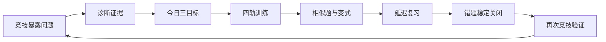
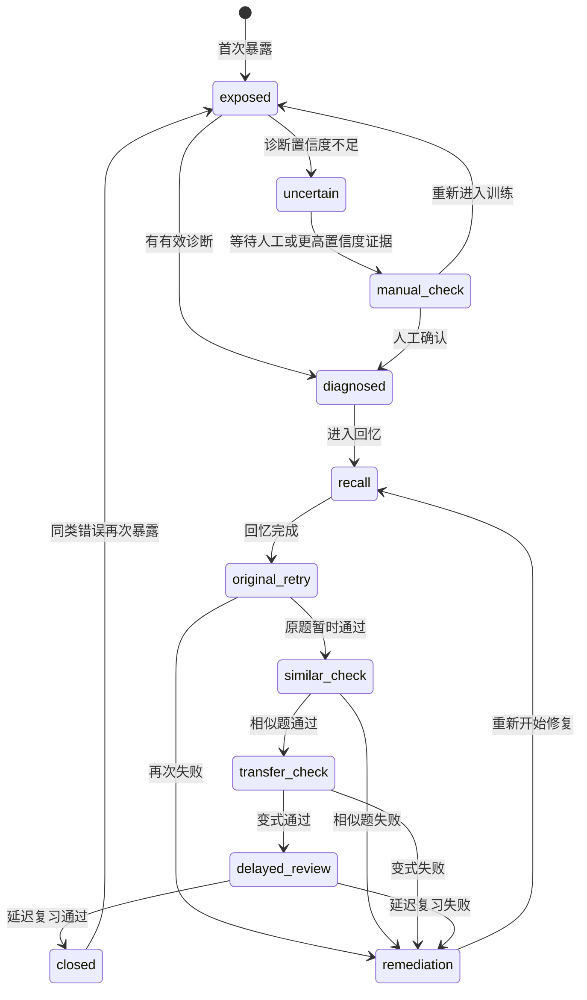

# 刷吧 v1.5.0「学习中心」UI 与交互验收规格

> 文档性质：产品 / 前端实现与验收合同
>
> 适用版本：v1.5.0（学习闭环第一版）
>
> 目标读者：实现 Agent、前端验收 Agent、后端接口设计 Agent、人工验收者
>
> 本文定义一个已经完成受控实现、仍待桌面端人工验收的独立“学习中心”页面。它不替换、不改造、不删除现有 `InsightsView`、`ReviewView`、`MasteryMapView` 或其他已有数据页；正式放量前继续由 feature flag 隔离，旧页面保留为回退入口。

---

## 0. 不可违背的范围与产品原则

### 0.1 当前实施阶段与范围

本规格不是“只写文档”的交付说明，而是 v1.5.0 学习闭环的持续实施与验收合同。当前实际状态为：

- **Phase A 受控实现与自动审查已完成，待桌面端人工验收**：学习证据、置信度门控、诊断、追加式投影、失败审计、早期 schema 迁移和结构化 stable gate 已进入工作区；普通/批量 Codex 回传只裁决任务创建时冻结绑定的既有 attempt，不新增 attempt、不修改 progress、不产生 ELO。
- **Phase B 受控实现与自动审查已完成，待桌面端人工验收**：`TodayView` 已具备非压力完整题组快照与整组 Codex 草稿任务入口；提交、跳过、收藏、队列缩短和题组结束后仍能保留任务上下文，压力/闪击模式继续隔离。
- **Phase C 只读/影子实现与自动门禁已完成，待桌面端人工验收**：独立 `LearningCenterView`、三账分区、今日三目标、五指标、错题状态链、最近证据、四轨影子推荐、局部错误与证据抽屉已经实现；正式四轨计划写入、正式 XP / 成就账、好友广播放量和 ranked-only 历史迁移尚未开启。
- **发布状态**：七个 feature flag 均默认关闭；尚未升版本、打包、提交、推送、发布或正式放量。

当前实现仍不得破坏以下边界：

- `src/views/InsightsView.tsx`、`src/views/ReviewView.tsx`、`src/views/MasteryMapView.tsx` 等现有数据页继续保留；
- 新数据页位于独立 `src/views/LearningCenterView.tsx`，不能替换、覆盖或强制迁移旧 `InsightsView` / `ReviewView`；
- `TodayView` 只保留非压力整组批改入口及必要的轻量跳转，不被改造成学习中心，也不改变压力模式的原有结算；
- 数据库、题库源目录、坚果云同步逻辑、Rating/ELO 结算逻辑仍须遵守项目既有契约；学习证据投影不得改写历史 attempts 或历史 ELO events。
当前 Phase C 受控实现遵守以下边界：

- 新建 `src/views/LearningCenterView.tsx`；
- 新建学习中心专用组件目录或组件文件；
- 新增只读聚合接口与必要的数据契约；
- 在导航中增加一个受开关控制的新入口；
- 在新页面中调用已有能力，例如今日推荐、复习队列、掌握图谱、收件箱、压力报告。

### 0.2 三账分离是硬约束

学习中心必须同时展示，但严格区分三套概念：

1. **训练账（Training Ledger）**
   - 记录日常训练、复习、变式、延迟复习、错题关闭、学习时长与训练 XP。
   - 允许错误，重点是暴露问题、修复问题、形成证据链。
2. **竞技账（Competitive Ledger）**
   - 记录高压演练 / 排位模式的 Rating、ELO、段位、赛季、胜负与压力表现。
   - 只有符合竞技模式结算条件的记录才可进入。
3. **激励账（Incentive Ledger）**
   - 记录 XP、成就、连续完成、计划完成、错题拆弹、变式成功、实战转化等。
   - 只能提供动力，不能反向改写训练结论或竞技分。

**强制文案与验收规则：**

- 训练 XP 不得增加、替代、折算或伪装成 ELO / Rating；
- “学习突破”可以获得 XP / 成就，但不会给竞技表现加 Buff；
- 竞技表现可以反哺学习计划，但不能为了鼓励用户而人为提高 ELO；
- 任何页面同时出现 XP 与 ELO 时，必须使用不同标签、不同区域和不同说明；
- 不能出现“完成训练后 Rating +X”这类误导性文案。

### 0.3 产品闭环

学习中心的主叙事不是“数据大屏”，而是：



首屏必须回答：

- 我今天最应该做哪三件事？
- 为什么是这三件事？
- 做到什么算完成？
- 我是在提高学习掌握，还是在进行竞技表现？
- 最近哪些薄弱点已经稳定修复，哪些只是暂时做对？

---

## 1. 现有页面与 UI 资产基线

实现 Agent 必须以当前页面为视觉与交互基线，不另起一套视觉系统。

### 1.1 `TodayView` 可复用能力

当前训练页已经具备以下可复用语义：

- 推荐队列 `RecommendedQuestion[]`；
- `score`、`reason`、`reasonCode` 推荐理由；
- 单题 `recordAttempt`；
- 日常纸笔 / 复习模式区分；
- Rating 表现展示；
- 题后修复备注、断点标签、Codex 单题任务；
- 高压演练启动、完成、批改等待与学习报告入口；
- 背景好友同步触发。

学习中心不重复实现答题工作台。它只负责：

- 计划编排；
- 学习状态总览；
- 推荐理由解释；
- 下一步动作跳转；
- 训练账与竞技账的分栏展示。

### 1.2 `ReviewView` 可复用能力

当前复盘页已经具备：

- 到期队列、复习计划、复习历史；
- 按章节 / 学科筛选；
- 错题、到期题、不确定题、AI 诊断题分类；
- 最早错误、修复建议、复习间隔展示；
- 复习轨迹与题目详情；
- 变式入口、批量练习入口。

学习中心只呈现复盘的聚合摘要与“继续修复”入口，不复制完整错题地图。

### 1.3 `MasteryMapView` 可复用能力

当前掌握图谱已经具备：

- 学科 → 章节 → 考点节点层级；
- treemap / 章节卡两种视图；
- 未开始、数据不足、需要加强、逐步稳定、掌握良好状态；
- 覆盖率、到期数、薄弱数、样本量与证据来源；
- 节点档案和变式练习入口。

学习中心只提供“五指标摘要 + Top 3 瓶颈”，点击后跳转或打开学习中心内的轻量抽屉；完整图谱仍留在旧页。

### 1.4 `GradingReportModal` 可复用能力

当前学习报告已经具备：

- 总体正确 / 部分正确 / 错误 / 不确定统计；
- 用时、平均用时、Rating 汇总；
- 六维表现；
- 逐题最早错误断点；
- 错误标签、薄弱标签、专项修复动作；
- 更优解法；
- Codex 置信度；
- 题目详情、收藏、变式入口。

学习中心在“最近报告”卡片中只做摘要，不复制完整报告正文。点击“阅读报告”沿用现有报告容器或打开新页面，不改旧报告逻辑。

### 1.5 视觉基线

复用现有 CSS 变量和组件语义：

- `var(--canvas)` 作为页面底色；
- `var(--surface)` 作为卡片底色；
- `var(--line)`、`var(--line-success)` 作为边界；
- `var(--ink)`、`var(--muted)`、`var(--quiet)` 作为文字层级；
- `var(--green)` / `var(--green-soft)` 表示主要学习行动；
- `var(--blue-soft)` 表示信息提示；
- `var(--success-soft)` 表示已经通过或稳定；
- `var(--coral-soft)` / `var(--danger)` 表示需要注意但不羞辱用户；
- 现有 `.primary-button`、`.secondary-button`、`.icon-button`、`.ui-modal`、`.empty-mini`、`.section-intro`、`.review-*`、`.mastery-*` 卡片风格。

要求：白底 / 暖色 / 深色主题均可读；不使用新的大面积渐变、排行榜式炫耀动画或与旧页不一致的圆角、阴影、字体系统。

---

## 2. 页面定位与入口策略

### 2.1 页面名称

- 中文名称：**学习中心**
- 推荐英文标识：`learning-center`
- 页面定位短句：**把今天该学什么、为什么学、学到什么程度，放在一个可执行的闭环里。**

### 2.2 导航策略

为了避免大改 UI：

1. 现有“今日训练”“复盘”“数据 / Insights”等入口原样保留；
2. 学习中心作为一个**新增入口**，只在 `learningCenterV1` 开关开启时出现；
3. 默认放在“今日训练”之后、“复盘”之前，或放入现有侧栏的“学习”分组；最终实现不得移动已有入口；
4. 关闭开关时，用户完全看不到新入口，旧导航和旧数据页行为不变；
5. 不把学习中心重命名为 Insights，也不把旧 InsightsView 重定向到学习中心；
6. 从 TodayView / ReviewView / GradingReportModal 只能增加“查看学习中心”跳转，不改变原按钮原有行为。

### 2.3 页面尺寸与滚动

- 桌面端主内容最大宽度：建议 `1280px–1440px`，沿用现有页面居中规则；
- 页面采用单列纵向流，首屏不强制塞入全部图表；
- 卡片之间使用现有间距尺度，避免 10 个以上独立 KPI 卡片横向堆叠；
- 只有页面主体滚动，顶部标题与关键操作不应被多个嵌套滚动容器截断；
- 移动 / 窄窗口优先保证按钮、文本和卡片可读，不追求同时展示完整三列布局。

---

## 3. 信息架构与页面结构

页面由六个区块组成，顺序固定但每个区块可按加载状态折叠：

```text
学习中心
├─ A. 页面头部：学习状态 + 今日进度 + 刷新 / 设置
├─ B. 今日作战计划：三目标总览与完成条件
├─ C. 四轨推荐：修复 / 巩固 / 迁移 / 挑战
├─ D. 能力画像：掌握、流畅、迁移、保持、置信度五指标
├─ E. 错题闭环：状态机进度与待处理任务
├─ F. 双账与社交反馈：训练账、竞技账、好友动态
```

### 3.1 A 区：页面头部

显示：

- 页面标题“学习中心”；
- 一句根据状态生成的短说明，例如“今天先修复 2 个高风险断点，再做 1 个变式验证。”；
- 今日训练完成度：`已完成 / 计划题数` 与 `已用时 / 计划时长`；
- 学习数据最近更新时间；
- 刷新按钮；
- 可选的“计划设置”按钮（只打开学习中心设置，不改全局设置）。

不显示：

- 把 ELO 当作首屏唯一核心数字；
- 把训练 XP 与 Rating 拼成一个总战力；
- 未经证据支持的“已掌握全部知识点”。

### 3.2 B 区：今日三目标

这是页面最重要区块，必须在首屏可见。

默认生成不超过三个目标：

1. **修复目标**：处理当前最高优先级的薄弱断点 / 到期错题；
2. **验证目标**：完成一题相似题或变式题，验证是否能迁移；
3. **保持 / 实战目标**：完成延迟复习，或在条件满足时进入一次压力演练。

目标数量可以少于三项：没有可靠证据时显示“建立第一条证据”，没有可用变式时不伪造目标。

每个目标必须包含：

- 标题；
- 类型：`repair | consolidate | transfer | challenge`；
- 目标知识点；
- 预计时间；
- 当前证据；
- 可执行按钮；
- 明确完成条件；
- 当前状态：未开始 / 进行中 / 暂时通过 / 稳定完成 / 被阻塞；
- 是否影响训练计划；
- 失败后的下一步。

目标卡示例：

```text
目标 1 · 修复
定积分换元的上下限处理
最近 3 次相关作答中有 2 次出现上下限错误
预计 12 分钟 · 需要完成 2 题
完成条件：相似题正确 1 次，并写出换元后的上下限
[开始修复]
```

### 3.3 C 区：四轨推荐

四轨为默认推荐策略，不是四个强制任务列表：

| 轨道 | 默认权重 | 主要目的 | 允许的结果 |
|---|---:|---|---|
| 修复 Repair | 40% | 处理到期题、概念盲区、重复错误 | 错误也算有效暴露，不扣竞技分 |
| 巩固 Consolidate | 25% | 让近期正确变得稳定、提升流畅度 | 原题重做不能单独宣称稳定掌握 |
| 迁移 Transfer | 20% | 相似题、变式题、跨题型验证 | 必须记录是否为不同题 / 不同结构 |
| 挑战 Challenge | 15% | 综合、限时、压力适应、探索 | 仅在修复债务可控时提高比例 |

权重必须可自适应：

- 到期复习或高风险错题较多时，修复 + 巩固比例提高；
- 迁移证据不足时，迁移不得降为 0，至少保留一个验证机会；
- 连续多日只完成挑战而不处理修复目标时，下一次计划需显式提醒；
- 没有可验证题目时显示“暂无可用变式”，不能生成不存在的题目 ID。

每张推荐卡必须展示：

- 轨道标签；
- 题目 / 任务名称；
- 知识点；
- 预计耗时；
- 推荐理由；
- 证据来源数量或时间；
- 成功标准；
- `[开始]`、`[换一道]`、`[稍后]` 操作；
- 若为 AI 诊断推荐，显示置信度状态，不强迫用户采纳低置信度结论。

推荐理由至少遵守：

```text
为什么现在推荐：最近 3 次“二重积分换序”中有 2 次在区域边界处出错。
本题要验证：能否先画区域，再正确写出积分上下限。
完成标准：独立完成，且不再出现同类断点。
```

推荐刷新必须稳定：页面刷新、切换旧页面再返回，不得无故重新洗牌今日计划。只有用户主动“换一道”、题目无效、时间预算改变、计划完成或用户确认重排时才允许重排。

### 3.4 D 区：能力画像五指标

学习中心使用五个互相独立的指标，不用一个总分掩盖问题：

1. **掌握 Mastery**：是否理解并能完成当前知识点；
2. **流畅 Fluency**：是否能在合理时间内稳定完成；
3. **迁移 Transfer**：是否能在不同题型 / 变式中使用；
4. **保持 Retention**：间隔一段时间后是否仍能回忆并完成；
5. **证据置信度 Confidence**：当前判断有多可靠，是否需要更多样本。

五指标显示方式：

- 默认使用五条紧凑进度条或五边形小图，不使用巨大雷达图占满首屏；
- 每项显示数值或分级、最近一次证据时间、证据数量、状态词；
- 低样本指标显示“数据不足”，不要显示虚假的 0 分；
- 指标变化只显示可解释原因，例如“变式成功 +8”“延迟复习失败 -12”；
- 点击指标可打开证据抽屉，列出最近若干条有效证据。

推荐状态词：

- `未观察`：没有可用证据；
- `初步`：只有 1 次或单一来源证据；
- `不稳定`：有正确记录但缺少变式 / 延迟证据，或存在冲突；
- `稳定`：满足稳定掌握条件；
- `衰减风险`：过去有效但超过复习间隔或近期失败；
- `待人工确认`：AI 置信度不足或证据冲突。

### 3.5 E 区：错题状态机

学习中心显示“错题闭环”摘要和待处理队列，完整错题地图仍使用 `ReviewView`。

状态机：



界面中必须区分：

- **暂时通过**：原题或相似题做对，但尚未完成变式 / 延迟证据；
- **稳定关闭**：至少满足稳定关闭条件；
- **复发**：曾关闭但同类断点再次出现；
- **不确定**：不进入正确率、掌握度、ELO 结算，但保留诊断待处理。

不同错误分类的默认路径：

| 错误类 | 默认路径 | 主要下一动作 |
|---|---|---|
| 瞄准失误 | 快速重做 → 短间隔复核 → 关闭 | 检查符号、边界、抄写 |
| 概念盲区 | 概念补丁 → 相似题 → 变式 → 延迟复习 | 回到定义 / 定理前提 |
| 战术绕路 | 更优方法阅读 → 限时相似题 → 限时变式 | 练突破口与经济性 |
| 混合 | 先处理最早断点，再按主要错误路径 | 不能同时塞入多个强制任务 |
| 不确定 | 人工确认 / 重新提交草稿 | 不更新核心画像 |

### 3.6 F 区：双账与好友动态

#### 训练账卡

展示：

- 今日训练题数、学习时长；
- 今日计划完成度；
- 到期复习数；
- 正在修复的错题链；
- 变式成功数；
- 延迟复习成功数；
- 本周训练 XP；
- 最近获得的学习成就。

说明文案：

> XP 只用于学习激励，不代表考试战力，也不会自动增加 Rating / ELO。

#### 竞技账卡

展示：

- 当前 Rating；
- 当前 ELO / 段位；
- 赛季名称；
- 最近一次压力演练表现；
- 竞技结算次数；
- 最近变化及原因；
- “由训练暴露的问题”入口。

说明文案：

> 只有高压演练 / 排位模式的有效结算才影响竞技账。日常训练和复习不会扣 ELO，也不会用训练 XP 改写 Rating。

#### 好友动态卡

好友动态只播报有学习意义的事件，不播报每一道普通题：

允许播报：

- 完成一次高压演练并产生有效 Rating / ELO 结算；
- 错题链达到“稳定关闭”；
- 变式迁移成功；
- 延迟复习成功；
- 连续复习达到 7 / 14 / 30 天；
- 某薄弱点完成“实战转化”：训练修复后在竞技中再次正确；
- 完成今日三目标；
- 公开学习报告已生成（仅当用户允许公开摘要）。

默认不播报：

- 每一道普通题；
- 低置信度 AI 诊断；
- 用户尚未确认的收件箱结果；
- 私密题目答案、草稿、完整报告内容；
- 训练 XP 的单次波动。

好友动态卡必须显示事件时间、事件类型、公开摘要与隐私状态。好友数据延迟时显示“最后同步于……”，不能显示“实时”字样，除非数据确实在允许的同步窗口内更新。

---

## 4. 数据契约草案（TypeScript）

以下是实现 Agent 的前端契约草案。字段可根据后端实际命名适配，但语义不可删减。所有时间字段使用 ISO 8601 字符串，分数使用明确的 0–1 或 0–100 范围，不允许同一字段混用。

```ts
export type LearningCenterTrack =
  | 'repair'
  | 'consolidate'
  | 'transfer'
  | 'challenge'

export type LearningCenterLoadingState =
  | 'idle'
  | 'loading'
  | 'refreshing'
  | 'ready'
  | 'empty'
  | 'error'

export type LearningConfidenceState =
  | 'unknown'
  | 'low'
  | 'medium'
  | 'high'
  | 'conflict'

export type LearningSkillState =
  | 'unseen'
  | 'exposed'
  | 'diagnosed'
  | 'learning'
  | 'unstable'
  | 'stable'
  | 'decaying'
  | 'remediating'
  | 'uncertain'

export type LearningNextAction =
  | 'move_on'
  | 'quick_retry'
  | 'recall'
  | 'review_concept'
  | 'practice_similar'
  | 'practice_variant'
  | 'timed_retry'
  | 'schedule_delayed_review'
  | 'manual_check'
  | 'open_report'

export type LearningLedger = 'training' | 'competitive' | 'incentive'

export type LearningMetricKey =
  | 'mastery'
  | 'fluency'
  | 'transfer'
  | 'retention'
  | 'confidence'

export type LearningMetric = {
  key: LearningMetricKey
  value: number | null // 0-100；无样本时为 null，不得伪装为 0
  state: 'unseen' | 'initial' | 'unstable' | 'stable' | 'risk' | 'conflict'
  evidenceCount: number
  lastEvidenceAt: string | null
  delta: number | null
  deltaReason: string | null
  description: string
}

export type LearningEvidenceRef = {
  id: string
  source: 'attempt' | 'review' | 'variant' | 'delayed_review' | 'pressure' | 'codex'
  questionId: number | null
  attemptId: number | null
  sessionId: string | null
  observedAt: string
  confidence: number | null // 0-1
  accepted: boolean
  note: string | null
}

export type LearningObjectiveStatus =
  | 'not_started'
  | 'in_progress'
  | 'temporarily_passed'
  | 'stable_completed'
  | 'blocked'
  | 'skipped'

export type LearningObjective = {
  id: string
  order: 1 | 2 | 3
  track: LearningCenterTrack
  title: string
  categoryId: number | null
  categoryPath: string | null
  status: LearningObjectiveStatus
  estimatedMinutes: number
  plannedItemCount: number
  completedItemCount: number
  whyNow: string
  evidenceIds: string[]
  successCriteria: string
  nextAction: LearningNextAction
  questionIds: number[]
  isUserPinned: boolean
  blockedReason: string | null
}

export type RecommendationReason = {
  track: LearningCenterTrack
  targetCategoryId: number | null
  evidenceText: string
  goalText: string
  successCriteria: string
  sourceEvidenceIds: string[]
  confidence: number | null
}

export type LearningRecommendation = {
  id: string
  questionId: number | null
  title: string
  categoryPath: string | null
  track: LearningCenterTrack
  score: number
  estimatedMinutes: number
  state: 'available' | 'completed' | 'deferred' | 'invalid' | 'blocked'
  reason: RecommendationReason
  variantOfQuestionId: number | null
  isDifferentQuestion: boolean
  isDifferentStructure: boolean
  actions: Array<'start' | 'replace' | 'defer' | 'open_detail'>
}

export type MistakeChainStage =
  | 'exposed'
  | 'diagnosed'
  | 'recall'
  | 'original_retry'
  | 'similar_check'
  | 'transfer_check'
  | 'delayed_review'
  | 'closed'
  | 'remediating'
  | 'uncertain'
  | 'manual_check'

export type MistakeChain = {
  id: string
  categoryId: number | null
  categoryPath: string
  label: string
  errorClass: 'aiming' | 'concept' | 'tactics' | 'mixed' | 'uncertain'
  stage: MistakeChainStage
  statusLabel: string
  firstExposedAt: string
  lastObservedAt: string
  nextReviewAt: string | null
  repeatedCount: number
  evidenceCount: number
  confidence: number | null
  earliestError: string | null
  advice: string | null
  nextAction: LearningNextAction
  originalRetryPassed: boolean
  similarPassed: boolean
  transferPassed: boolean
  delayedReviewPassed: boolean
  stableClosedAt: string | null
  relapseAt: string | null
  blockedReason: string | null
}

export type TrainingLedgerSummary = {
  todayProblems: number
  todayMinutes: number
  weeklyProblems: number
  weeklyMinutes: number
  dueReviews: number
  activeMistakeChains: number
  stableClosedChains: number
  variantPasses: number
  delayedReviewPasses: number
  xpThisWeek: number
  achievements: Array<{
    id: string
    label: string
    earnedAt: string
  }>
}

export type CompetitiveLedgerSummary = {
  rating: number | null
  elo: number | null
  rank: string | null
  seasonName: string | null
  settlementCount: number
  lastDelta: number | null
  lastMatchAt: string | null
  validPressureSessions: number
  pendingSettlementCount: number
  note: string
}

export type IncentiveLedgerSummary = {
  xp: number
  level: number | null
  streakDays: number
  weeklyGoalCompleted: number
  weeklyGoalTotal: number
  recentAchievements: string[]
}

export type FriendBroadcastEvent = {
  id: string
  friendProfileId: string
  friendName: string
  eventType:
    | 'pressure_settled'
    | 'mistake_closed'
    | 'variant_passed'
    | 'delayed_review_passed'
    | 'review_streak'
    | 'real_match_conversion'
    | 'daily_objectives_completed'
    | 'report_published'
  occurredAt: string
  title: string
  summary: string
  publicCategoryPath: string | null
  ratingDelta: number | null
  eloDelta: number | null
  xpDelta: number | null // 仅作为动态摘要，不能进入竞技账
  reportId: string | null
  privacy: 'public_summary' | 'private' | 'redacted'
}

export type LearningCenterData = {
  generatedAt: string
  today: {
    date: string
    objectives: LearningObjective[]
    completedCount: number
    totalCount: number
    completedMinutes: number
    plannedMinutes: number
  }
  recommendations: {
    weights: Record<LearningCenterTrack, number>
    items: LearningRecommendation[]
  }
  metrics: LearningMetric[]
  mistakeChains: MistakeChain[]
  training: TrainingLedgerSummary
  competitive: CompetitiveLedgerSummary
  incentive: IncentiveLedgerSummary
  friendEvents: FriendBroadcastEvent[]
  capabilities: {
    canBatchGradeDrafts: boolean
    canOpenPressureReport: boolean
    canOpenExistingMasteryMap: boolean
    canOpenExistingReviewView: boolean
    canReadFriendEvents: boolean
  }
}
```

### 4.1 数据来源与信任边界

- `attempt`、复习记录、压力会话等原始记录由本地确定性内核提供；
- Codex / AI 只提供诊断证据、最早错误、标签、建议与置信度；
- `uncertain` 或 `confidence < 0.75` 的诊断只能作为可见的原始证据 / 待确认建议，不得进入核心画像、正确率、掌握度、复习通过或 ELO 结算；其中 `<0.75` 的证据可以生成复核或训练建议，但不能更新核心学习状态；
- `0.75 ≤ confidence < 0.90` 的诊断可以参与学习状态更新，但统一按 **0.5 权重**计入；
- `confidence ≥ 0.90` 的诊断可以按 **1.0 权重**参与学习状态更新，但仍不得绕过确定性规则，也不得直接改变 ELO；
- `uncertain` 永远不计入正确率、掌握度、复习通过、ELO 结算；
- 旧历史记录可用于初始展示，但不得凭空推断“变式成功”或“延迟复习成功”。

### 4.2 稳定掌握 / 稳定关闭的最低证据

默认验收条件：

- 至少 3 次有效证据；
- 至少来自 2 道不同题目；
- 至少 1 次由显式 `variant_of_question_id`（或等价受控变式任务关系）关联的变式成功；
- 至少 1 次由存在且标记 `delayed_review_required=true` 的受控 `review_task_id` 产生的延迟复习成功，且 `review_started_at - previous_success_at >= 24h`；
- 最近没有同类概念错误；
- 证据置信度达到可接受阈值（低于 `0.75` 或 `uncertain` 不得作为稳定证据）；
- 不同题号只用于“题目多样性”计数，不能单独推断迁移、变式验证或延迟复习；
- 仅原题重复正确只能标记“暂时通过”，不能标记稳定。

后端若采用其他阈值，必须在接口字段中明确返回判定原因，前端不自行猜测。

---

## 5. 交互规格

### 5.1 页面加载

加载顺序：

1. 先渲染页面骨架、标题和当前时间；
2. 先显示可缓存的今日目标摘要；
3. 再加载画像、错题链、账本与好友动态；
4. 刷新期间保留已有内容，在按钮上显示刷新状态；
5. 单个区块失败不得让整个学习中心白屏。

刷新策略：

- 初次进入：完整加载；
- 手动刷新：局部刷新，保留旧数据并显示“正在更新”；
- 从后台回到前台：可触发轻量刷新，但不得重复生成新计划；
- 学习中心不应每秒轮询；好友动态沿用现有同步策略，并显示最后同步时间；
- 数据更新时间必须对用户可见。

### 5.2 今日目标操作

每个目标至少支持：

- 开始；
- 查看依据；
- 延后；
- 换题 / 替换；
- 打开复习 / 训练 / 变式；
- 目标完成后查看证据；
- 被阻塞时查看原因并获取下一步。

“完成目标”不能由前端按钮直接伪造。应由完成题目、变式、延迟复习、确认报告等确定性事件驱动。

### 5.3 非压力模式一键批改当前题组草稿

学习中心必须为非压力模式提供一个可开关能力：

> **“把当前题组交给 AI 批改草稿”**

入口建议放在：

- 今日三目标区域的训练目标卡操作菜单；或
- 四轨推荐中的“本组训练”操作栏；或
- 训练完成状态下的结果摘要卡。

不得把它伪装成压力演练，也不得自动进入竞技账。

交互流程：

1. 用户选择当前题组或已完成的题目集合；
2. 展示题数、预计处理内容、隐私提示；
3. 用户确认后调用现有批量 Codex 任务能力（实现 Agent 应复用 `createCodexBatchTask` 或等价已有 API）；
4. 生成可复制的任务提示与收件箱目标；
5. 显示“等待批改 / 部分返回 / 已完成 / 需要确认”；
6. 只有用户在收件箱确认后，才把确定性允许的记录写入画像；
7. `uncertain` 项保留诊断但不计入核心状态；
8. 批改失败可重试，不重复写入，不创建重复状态事件。

必须明确展示：

- “AI 提供证据，刷吧内核负责最终记账”；
- “本次为训练批改，不影响 ELO”；
- “未上传或未附草稿的题目不会被猜测批改”。

### 5.4 五指标详情抽屉

点击指标后打开轻量抽屉或对话框：

- 标题和当前状态；
- 计算口径；
- 最近 3–5 条有效证据；
- 每条证据来源、时间、题目、结果、置信度；
- 指标变化原因；
- 下一步建议；
- `[进入对应任务]`。

抽屉必须可用键盘关闭，焦点回到触发按钮。

### 5.5 错题链详情

点击错题链显示：

- 当前阶段；
- 错误类型；
- 最早错误断点；
- 最近证据；
- 已完成的关卡；
- 缺失的关卡；
- 推荐下一动作；
- “暂时通过”与“稳定关闭”的差异说明；
- 进入原题 / 相似题 / 变式题 / 延迟复习的按钮。

用户不能通过点击“已看懂”直接关闭错题链。

### 5.6 竞技账交互

点击竞技账：

- 打开已有压力报告或竞技历史；
- 显示本次是否真正结算；
- 如果尚未完成 Codex 报告，状态必须是“待批改 / 待确认”，不能提前显示 ELO 变化；
- 如果报告部分完成，显示“部分报告”，不得将缺失项当作错误或正确；
- 重复打开同一报告不应重复结算。

### 5.7 好友动态交互

- 动态卡默认只显示摘要；
- 点击可查看公开的事件详情或脱敏报告摘要；
- 私密事件显示“好友选择不公开”；
- 事件源数据过期时显示同步时间，不显示虚假的实时状态；
- 失败加载允许单独重试好友区；
- 不能因为好友同步失败阻塞训练区和画像区。

---

## 6. 状态设计：空、加载、错误、低置信度

### 6.1 页面级状态

#### 首次加载

显示页面骨架：

- 标题骨架；
- 今日目标 3 个卡片骨架；
- 五指标条骨架；
- 错题链列表骨架；
- 双账卡骨架。

骨架不能使用高频闪烁；加载超过 1.5 秒时提示“正在整理你的学习证据”。

#### 完全空数据

文案：

> 还没有足够的作答证据。先完成一道题，学习中心会从第一条证据开始建立画像。

按钮：

- 开始今日训练；
- 选择章节；
- 查看如何记录有效证据。

不得显示满屏 0 分或“你掌握度为 0”。

#### 部分为空

每个区块独立空态：

- 无今日目标：`今天没有可靠的自动目标，先完成一题建立证据`；
- 无错题链：`当前没有需要拆解的错题链`；
- 无变式：`当前题库没有可验证的变式，不会虚构题目`；
- 无好友动态：`好友还没有可播报的公开学习事件`；
- 无竞技记录：`完成一次高压演练并确认报告后，这里会出现竞技账`。

#### 部分失败

区块内显示：

- 哪一块加载失败；
- 重试按钮；
- 最后一次成功数据时间；
- 失败不会清空其他区块。

页面级错误只用于聚合接口完全不可用：

> 学习中心暂时无法读取最新数据。旧数据仍保留，点击重试。

### 6.2 低置信度状态

低置信度必须是可见状态，不得静默混入确定结论。

显示规则：

- `uncertain` 或 `< 0.75`：显示“待确认 / 低置信度”，不进入核心画像；可以生成复核或训练建议，但不作为稳定、正确率或复习通过证据；
- `0.75–<0.90`：显示“较可信”，参与学习状态更新时使用 **0.5 权重**；
- `≥ 0.90`：显示“高可信”，参与学习状态更新时使用 **1.0 权重**，仍由确定性规则最终判定；
- 证据冲突：显示“证据冲突”，优先推荐复核，不显示虚假精确分数；
- 延迟复习只有在 `review_task_id` 精确关联到存在且标记 `delayed_review_required=true` 的受控任务，并与上次成功证据精确间隔 `>=24h` 时，才能显示为有效证据；`mode` 文本不能替代这些结构化关系。

低置信度卡必须提供：

- 置信度百分比或分档；
- 为什么不确定；
- 下一步如何提高置信度；
- `[重新提交草稿]` 或 `[人工确认]`（若系统支持）。

### 6.3 网络 / 坚果云 / 好友同步错误

好友同步异常只影响好友区：

- 显示最后成功同步时间；
- 显示“本地学习数据不受影响”；
- 提供重试 / 打开好友设置；
- 不显示对方过期数据为“实时状态”；
- 不因 HTTP 409 或共享路径错误导致整个页面报错。

---

## 7. 组件级设计与 Props 草案

以下组件名称是建议，不要求实现 Agent 原样采用；但是组件职责和数据边界必须保持。

```ts
export type LearningCenterViewProps = {
  initialData?: LearningCenterData | null
  featureFlags: LearningCenterFeatureFlags
  onNavigate: (target: LearningCenterNavigationTarget) => void
  onNotify: (message: string) => void
  onRefresh?: () => Promise<void>
}

export type LearningCenterFeatureFlags = {
  // 与《双引擎学习闭环执行说明书》完全一致；禁止新增 snake_case、kebab-case 或局部同义开关。
  learningCenterV1: boolean
  learningEvidenceProjectionV1: boolean
  lowConfidenceGateV1: boolean
  nonPressureBatchGradingV1: boolean
  shadowRecommendationPlanV1: boolean
  rankedOnlyEloV1: boolean
  friendBroadcastsV1: boolean
}

export type LearningCenterNavigationTarget =
  | { type: 'today'; questionId?: number | null; objectiveId?: string }
  | { type: 'review'; questionId?: number | null; mistakeChainId?: string }
  | { type: 'mastery'; categoryId?: number | null }
  | { type: 'pressure'; sessionId?: string | null }
  | { type: 'report'; sessionId: string }
  | { type: 'friends'; friendProfileId?: string | null }
  | { type: 'batch_grade'; questionIds: number[] }

export type LearningCenterHeaderProps = {
  generatedAt: string | null
  today: LearningCenterData['today'] | null
  loading: boolean
  refreshing: boolean
  onRefresh: () => void
  onOpenSettings?: () => void
}

export type TodayObjectivesProps = {
  objectives: LearningObjective[]
  loading: boolean
  onStart: (objective: LearningObjective) => void
  onDefer: (objectiveId: string) => void
  onReplace: (objectiveId: string) => void
  onOpenEvidence: (objectiveId: string) => void
  onBatchGradeDrafts?: (questionIds: number[]) => void
}

export type FourTrackRecommendationsProps = {
  weights: Record<LearningCenterTrack, number>
  items: LearningRecommendation[]
  loading: boolean
  onStart: (item: LearningRecommendation) => void
  onReplace: (itemId: string) => void
  onDefer: (itemId: string) => void
  onOpenReason: (item: LearningRecommendation) => void
}

export type FiveMetricProfileProps = {
  metrics: LearningMetric[]
  loading: boolean
  onOpenMetric: (metric: LearningMetricKey) => void
}

export type MetricEvidenceDrawerProps = {
  metric: LearningMetric
  evidence: LearningEvidenceRef[]
  open: boolean
  onClose: () => void
  onStartNextAction: (metric: LearningMetric) => void
}

export type MistakeStateMachineProps = {
  chains: MistakeChain[]
  loading: boolean
  onOpenChain: (chain: MistakeChain) => void
  onStartNextAction: (chain: MistakeChain) => void
  onOpenReview: (chain: MistakeChain) => void
}

export type MistakeChainDetailProps = {
  chain: MistakeChain
  open: boolean
  onClose: () => void
  onStartOriginalRetry: (chainId: string) => void
  onStartSimilar: (chainId: string) => void
  onStartTransfer: (chainId: string) => void
  onScheduleDelayedReview: (chainId: string) => void
}

export type LedgerSplitProps = {
  training: TrainingLedgerSummary
  competitive: CompetitiveLedgerSummary
  incentive: IncentiveLedgerSummary
  onOpenTrainingHistory: () => void
  onOpenCompetitiveHistory: () => void
  onOpenAchievements: () => void
}

export type FriendBroadcastsProps = {
  events: FriendBroadcastEvent[]
  loading: boolean
  lastSyncedAt: string | null
  onRetry: () => void
  onOpenEvent: (event: FriendBroadcastEvent) => void
}

export type BatchDraftGradeEntryProps = {
  questionIds: number[]
  mode: 'training' | 'review'
  open: boolean
  onClose: () => void
  onConfirm: (questionIds: number[]) => Promise<void>
  onOpenInbox: () => void
}
```

### 7.1 组件验收边界

- `LearningCenterView` 不直接计算掌握度、ELO、推荐分或状态机迁移；
- UI 只消费聚合数据和命令结果；
- 所有“完成”“稳定关闭”“结算”状态必须由后端事件或已有命令返回；
- 组件失败应局部降级；
- 所有异步动作必须有 `loading / success / error` 三态；
- 所有按钮在异步期间防重复点击；
- 按钮文本应表达动作，例如“开始修复”“查看证据”“提交批改”，不要使用含义模糊的“确定”。

---

## 8. 响应式与无障碍要求

### 8.1 响应式断点

建议按内容能力而不是设备名称设计：

- `≥ 1200px`：今日目标可三列或 2+1 布局；四轨推荐可两列；双账可并排；
- `768–1199px`：今日目标两列；五指标两列；双账上下排列；
- `< 768px`：全部单列；目标卡与推荐卡全宽；五指标改为纵向列表；好友动态可折叠；
- `< 480px`：操作按钮允许满宽；不显示过长路径，使用折叠或省略并提供完整 `title` / 详情。

不得为了适配窄屏引入横向页面滚动。

### 8.2 键盘与焦点

- 所有卡片内可操作元素必须是真实 `<button>` / `<a>`，不得只给 `<div>` 加点击；
- Tab 顺序遵循页面顺序：刷新 → 今日目标 → 推荐 → 指标 → 错题链 → 双账 → 好友动态；
- 抽屉 / 对话框打开时焦点进入标题或第一可操作元素；
- 关闭后焦点回到触发按钮；
- `Esc` 可关闭抽屉 / 对话框；
- 焦点环不能被 `outline: none` 删除；
- 图表或进度条必须有文字等价物；
- 不得仅用颜色区分“正确 / 错误 / 稳定 / 风险”。

### 8.3 屏幕阅读器

- 页面根节点使用 `main`，区块使用 `section` 并设置可读标题；
- 进度条使用 `role="progressbar"`、`aria-valuenow`、`aria-valuemin`、`aria-valuemax`；
- 异步刷新状态使用 `aria-live="polite"`，错误使用 `role="alert"`；
- 低置信度、暂时通过、稳定关闭必须在可访问名称中体现；
- 图标按钮提供 `aria-label`；
- 不能把“最近 3 次中 2 次错误”只放在 tooltip 中，正文必须可读。

### 8.4 动效与主题

- 动效只用于状态变化、完成反馈和抽屉展开，不用于持续抢注意力；
- 遵守 `prefers-reduced-motion`；
- 深色主题下通过边框、图标、文字和纹理区分状态，不能只依赖低对比度背景色；
- 颜色对比度至少满足 WCAG AA；
- XP、成就可以有轻量反馈，但不能模拟竞技胜利音效或造成误解。

---

## 9. 验收用例

验收 Agent 需要以真实数据、mock 数据和故障注入三类方式执行。每条用例都应记录：前置条件、操作、预期、实际、截图 / 日志。

### 9.1 导航与兼容性

| ID | 用例 | 预期 |
|---|---|---|
| LC-NAV-01 | 关闭 `learningCenterV1` | 学习中心入口不出现，旧页面可正常进入 |
| LC-NAV-02 | 开启 `learningCenterV1` | 新入口出现，旧 InsightsView / ReviewView / MasteryMapView 入口不变 |
| LC-NAV-03 | 从旧页面进入学习中心 | 新页加载，不改变旧页面状态 |
| LC-NAV-04 | 学习中心加载失败 | 旧页面仍可用，页面显示局部或页面级错误 |
| LC-NAV-05 | 刷新 / 返回再进入 | 今日计划不被无故洗牌 |

### 9.2 今日三目标

| ID | 用例 | 预期 |
|---|---|---|
| LC-OBJ-01 | 有到期复习与重复错误 | 修复目标优先，显示证据与完成标准 |
| LC-OBJ-02 | 无可靠证据 | 显示建立第一条证据，不伪造薄弱点 |
| LC-OBJ-03 | 目标已完成 | 显示稳定完成或暂时通过的真实状态，不能由前端按钮伪造 |
| LC-OBJ-04 | 用户点击延后 | 目标被延后，原因和时间可见，不丢失历史 |
| LC-OBJ-05 | 目标题目失效 | 提示不可用并允许替换，不生成不存在的题目 |
| LC-OBJ-06 | 目标包含 AI 低置信度诊断 | 显示待确认，不自动作为硬性目标 |

### 9.3 四轨推荐

| ID | 用例 | 预期 |
|---|---|---|
| LC-REC-01 | 默认权重展示 | 修复 40%、巩固 25%、迁移 20%、挑战 15% 或显示后端自适应权重 |
| LC-REC-02 | 到期债务很高 | 修复 / 巩固权重提高，并说明原因 |
| LC-REC-03 | 点击刷新页面 | 推荐顺序不变 |
| LC-REC-04 | 点击“换一道” | 只替换该卡，不重排整个计划 |
| LC-REC-05 | 题库无变式 | 显示暂无变式，不产生虚假题目 ID |
| LC-REC-06 | 推荐理由 | 每条理由可追溯到至少一条 evidence ID 或明确标记为探索 |
| LC-REC-07 | 连续刷强项 | 页面提醒处理薄弱目标，不能无限推荐熟题 |

### 9.4 五指标与证据

| ID | 用例 | 预期 |
|---|---|---|
| LC-MET-01 | 只有一次原题做对 | 掌握或迁移不显示稳定，状态为初步 / 不稳定 |
| LC-MET-02 | 原题正确、变式失败 | 迁移不通过，错题链回到修复 |
| LC-MET-03 | 变式成功、延迟复习失败 | 保留迁移证据，保持指标下降或风险，不标记稳定关闭 |
| LC-MET-04 | 延迟复习成功 | 保持指标有明确正向证据，错题链可进入稳定关闭判定 |
| LC-MET-05 | AI 为 `uncertain` 或置信度低于 `0.75` | 不进入核心画像、不进入 ELO、不计为复习通过；可保留为待确认建议 |
| LC-MET-06 | 证据冲突 | 显示冲突状态和下一步复核，不显示虚假的精确结论 |
| LC-MET-07 | 点击指标 | 证据抽屉可打开、关闭、键盘操作，焦点正确回收 |

### 9.5 错题状态机

| ID | 用例 | 预期 |
|---|---|---|
| LC-MIS-01 | 新错误进入系统 | 状态为暴露或已诊断，显示最早错误 / 待确认 |
| LC-MIS-02 | 原题重做正确 | 只到暂时通过 / 相似验证，不直接关闭 |
| LC-MIS-03 | 相似题失败 | 状态回到修复，显示失败证据，不删除之前记录 |
| LC-MIS-04 | 变式成功 | 迁移关卡通过，安排延迟复习 |
| LC-MIS-05 | 延迟复习成功 | 在满足最低条件后标记稳定关闭 |
| LC-MIS-06 | 稳定后同类错误复发 | 状态重新暴露，保留原关闭时间与复发时间 |
| LC-MIS-07 | 不确定诊断 | 不进入正确率、掌握度、ELO 和关闭条件 |

### 9.6 训练账 / 竞技账 / XP

| ID | 用例 | 预期 |
|---|---|---|
| LC-LED-01 | 完成普通训练 | 训练账 / XP 可变，竞技账不变 |
| LC-LED-02 | 完成复习题 | 复习状态可变，ELO 不变 |
| LC-LED-03 | 完成高压演练并确认有效报告 | 竞技账按既有规则结算，训练区可收到反哺任务 |
| LC-LED-04 | 高压报告未完成 | ELO 不提前结算，显示待批改 |
| LC-LED-05 | 完成学习成就 | XP / 成就可变，Rating / ELO 不因成就被人为提高 |
| LC-LED-06 | 重复确认同一报告 | 不重复产生 ELO / XP / 状态事件 |
| LC-LED-07 | 训练数据失败 | 不得丢失已保存的作答记录，页面局部降级 |

### 9.7 非压力批量 AI 批改

| ID | 用例 | 预期 |
|---|---|---|
| LC-BATCH-01 | 在普通训练中选择当前题组 | 可打开批量批改确认，不显示为压力模式 |
| LC-BATCH-02 | 确认批改 | 生成批量 Codex 任务 / 收件箱目标，显示题数与隐私提示 |
| LC-BATCH-03 | 草稿张数少于题数 | 未上传草稿的题不被猜测批改 |
| LC-BATCH-04 | 返回部分结果 | 显示部分完成，未返回项保留待处理 |
| LC-BATCH-05 | 返回 uncertain | 只保留诊断，不进正确率 / 掌握度 / ELO |
| LC-BATCH-06 | 重试任务 | 不产生重复记录或重复状态迁移 |
| LC-BATCH-07 | 用户未确认收件箱 | 结果不能自动写入正式画像 / 作答账 |

### 9.8 好友动态

| ID | 用例 | 预期 |
|---|---|---|
| LC-FRIEND-01 | 好友完成普通题 | 默认不播报每题动态 |
| LC-FRIEND-02 | 好友稳定关闭错题链 | 可播报一条脱敏事件 |
| LC-FRIEND-03 | 好友完成压力结算 | 显示有效 Rating / ELO 事件与时间 |
| LC-FRIEND-04 | 好友数据过期 | 显示最后同步时间，不标记实时 |
| LC-FRIEND-05 | 坚果云 / HTTP 409 | 仅好友区显示同步失败，训练区和画像区可用 |
| LC-FRIEND-06 | 好友隐私为私密 | 不显示题目答案、完整报告或私密分类 |

### 9.9 响应式与无障碍

| ID | 用例 | 预期 |
|---|---|---|
| LC-A11Y-01 | 全键盘操作 | 所有操作可达，焦点顺序合理 |
| LC-A11Y-02 | 打开并关闭抽屉 | 焦点进入抽屉，关闭后回到触发按钮 |
| LC-A11Y-03 | 使用屏幕阅读器 | 区块标题、状态、进度和错误可理解 |
| LC-A11Y-04 | 深色主题 | 文字与状态满足对比度，不能只靠颜色区分 |
| LC-A11Y-05 | `prefers-reduced-motion` | 动效减少但功能不丢失 |
| LC-A11Y-06 | 360px 窄屏 | 无横向滚动，按钮和长文本可操作 |

---

## 10. 分阶段启用与回滚开关

### 10.1 开关定义

建议由后端 / 前端统一读取，不允许各组件自行写死：

| 开关 | 默认 | 启用内容 | 回滚行为 |
|---|---|---|---|
| `learningCenterV1` | off | 显示新页面和入口 | 完全隐藏新入口，旧页面不受影响 |
| `learningEvidenceProjectionV1` | off | 五指标、错题状态与 stable gate 的只读投影 | 显示旧聚合，不计算或写入新学习状态 |
| `lowConfidenceGateV1` | off，自动不变量已通过，待桌面人工验收 | 低置信度门控与可视化 | 新诊断只作为旁路提示，不能改变旧结算 |
| `nonPressureBatchGradingV1` | off，自动不变量已通过，待桌面人工验收 | 非压力模式批量草稿批改入口 | 隐藏入口，不影响压力模式批改 |
| `shadowRecommendationPlanV1` | off | 四轨推荐影子计算与理由 | 显示旧推荐摘要，不改变 TodayView 队列或写正式计划 |
| `rankedOnlyEloV1` | off，旧非压力 ELO 历史迁移尚未完成 | 新结算仅允许压力/排位模式 | 保持旧结算路径；异常时不重算历史 |
| `friendBroadcastsV1` | off，正式广播与隐私端到端验收尚未完成 | 好友事件摘要 | 隐藏好友区，不影响好友页 |

### 10.2 当前阶段与后续启用顺序

#### Phase A：学习证据基础（受控实现与自动审查已完成）

已完成并纳入自动测试的范围：

- `learningEvidenceProjectionV1` 与 `lowConfidenceGateV1` 的受控实现；
- learning evidence、diagnosis、skill state、review task、投影失败审计的追加式存储与幂等迁移；
- `uncertain`、低置信度、未确认结果隔离；
- Codex 单题 / 批量诊断的不可变 `task_id -> attempt_id?` 上下文绑定；
- 诊断重试、压力 Receipt/Saga 和学习投影幂等；
- 旧空 fingerprint 迁移不重开已完成 / 已关闭 / 已归档复习任务；
- `uncertain` 或 `$confidence < 0.75$` 不进入核心画像；
- 诊断/回填不改写历史 attempts、历史 ELO events 或 `rating.rs` 规则；
- 变式和延迟复习只认结构化关联，缺证据时 transfer / retention 为 `blocked` / `null`。

#### Phase B：TodayView 非压力整组批改（受控实现与自动审查已完成）

已完成并纳入自动测试的范围：

- `nonPressureBatchGradingV1` 默认关闭并可在开发态受控开启；
- 日常、专项、复习等非压力模式保留完整题组快照；
- 当前题组可一键生成并复制整组 Codex 草稿批改任务；
- 题组提交、跳过、收藏、队列缩短或结束后不误丢完整快照；
- attemptId 在任务创建时不可变绑定，未作答题保持未绑定；
- 批量结果复用收件箱确认流程，未确认结果不得进入正式画像；
- 压力 / 闪击模式不显示日常批量入口，也不改变竞技结算；
- 已确认的非压力回传只裁决已绑定作答，不新建 attempt、不修改 progress、不产生 ELO。

#### Phase C：独立 LearningCenterView（只读/影子实现已完成）

已完成自动验证、仍待桌面端人工验收的范围：

1. 独立页面、导航与命令菜单入口均受 `learningCenterV1` 控制；
2. 首次加载、刷新、保留旧快照、局部错误、空状态和三账分栏；
3. 今日三目标、五指标画像、错题状态链、最近证据与证据抽屉；
4. 四轨推荐按 40 / 25 / 20 / 15 影子展示，不写 TodayView 正式队列；
5. 迁移 / 保持缺证据时显示 `blocked` / `—`，不存在正式激励账时显示“XP 暂无”；
6. 竞技账仍含旧非压力 ELO 历史时显示迁移警告，不宣称已经完全分账；
7. 证据抽屉支持 Esc、打开聚焦关闭按钮、关闭后恢复触发按钮焦点；
8. 已实现 360px 响应式规则，但仍需真实桌面窗口人工验证。

以下能力仍未正式启用：正式计划写入、正式 XP / 成就结算、好友广播白名单端到端放量、ranked-only 旧历史迁移。完成桌面人工验收、性能与回滚验证前，不替换旧推荐，不改变 ELO / Rating 规则。
### 10.3 回滚规则

任何一个阶段出现以下情况，立即关闭对应开关：

- 新页面白屏或阻塞旧页面；
- 训练记录丢失；
- ELO / Rating 与旧规则发生未授权变化；
- 同一报告重复结算；
- 低置信度结果污染正确率或画像；
- 推荐题目不存在或计划无限重排；
- 好友私密信息泄漏；
- 页面在窄屏无法操作；
- 新接口失败导致主训练流程不可用。

回滚后必须保留诊断日志和影子运行数据，不能通过删除历史数据掩盖问题。

---

## 11. 实现 Agent 的交付顺序

1. 先新增类型 / mock 数据 / 聚合读取接口，不改旧页；
2. 新建 `LearningCenterView` 与局部组件；
3. 先实现只读骨架和状态分支；
4. 接入今日三目标，只提供跳转，不直接修改旧训练逻辑；
5. 接入五指标与错题链摘要；
6. 接入训练账 / 竞技账 / 激励账；
7. 接入非压力批量批改入口，复用现有 Codex 收件箱确认机制；
8. 最后接入好友动态；
9. 通过 shadow mode 回放后，才开放新计划写入；
10. 任何新数据库写操作必须走 Tauri command，不得前端直写 SQLite。

每一步都必须保持可回滚，建议每个阶段独立 commit。不要在同一个 commit 中同时改导航、ELO、数据库迁移和 UI 大面积样式。

---

## 12. 验收通过标准（Definition of Done）

只有同时满足以下条件，学习中心一期才算通过：

- [ ] 人工确认现有 `InsightsView`、`ReviewView`、`MasteryMapView`、`TodayView`、`GradingReportModal` 行为未被破坏；
- [x] 新页面受开关控制，代码路径在关闭时隐藏导航、命令与页面挂载；
- [x] 首屏实现今日三目标，并展示“为什么”和“完成标准”；
- [x] 四轨推荐按 40 / 25 / 20 / 15 只读影子展示，不写正式队列；
- [x] 五指标分别展示掌握 / 流畅 / 迁移 / 保持 / 置信度；
- [x] 原题重复正确不能直接导致 stable 或错题关闭；
- [x] 变式和延迟复习只接受结构化证据，缺失时显示 `blocked` / `—`；
- [x] 低置信度、不确定、未确认和投影失败有独立状态，且不污染核心账；
- [x] 训练账、竞技账、激励账在字段与页面区域上分离；
- [x] 正式激励账不存在时显示“XP 暂无”，不会伪造 0 XP 或混入 ELO / Rating；
- [x] 非压力题组可一键生成批量 AI 草稿批改任务，回传只裁决冻结绑定的既有 attempt；
- [x] 高压演练使用 Receipt/Saga 幂等结算，补充报告失败重试不重复 attempt / ELO；
- [ ] 完成好友动态白名单、过期标注、隐私和报告跳转的桌面端端到端验收；
- [x] 单区块失败保留其他区块与旧快照，不导致整页白屏；
- [ ] 完成桌面窄屏、深色主题、完整键盘、屏幕阅读器和减少动效的人工验收；
- [ ] 人工确认所有新 flag 关闭后旧应用体验等价且旧数据页无需迁移；
- [x] 项目约定的构建、类型、Lint、Rust 测试、只读回放和 `git diff --check` 已全部通过；
- [x] 当前未升版本、未打包、未发布、未触碰签名私钥与题库源目录。

---

## 13. 给实现 Agent 的一句话任务定义

> 在不替换任何旧数据页、不改变现有 ELO / Rating 规则的前提下，新建一个受开关控制的“学习中心”，把今日三目标、四轨推荐、五指标画像、错题状态机、训练 / 竞技 / 激励三账和白名单好友动态组织成一个可执行、可解释、可回滚的学习闭环；AI 只提供诊断证据，确定性内核负责最终状态，训练 XP 永远不能混入 ELO / Rating。
