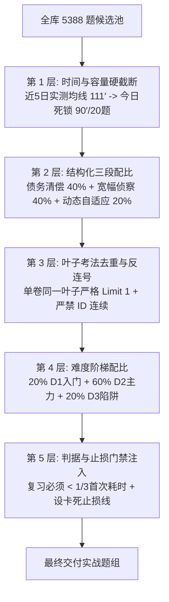

# 刷吧自适应取样与动态排产策略体系 (V2.0 进化版)

> **文档版本**：v2.0 · 权威算法策略规范  
> **制定日期**：2026-09-01  
> **制定人**：刷吧首席数学战术规划师  
> **适用对象**：考研数一全天题组排产、侦察卷抽样、断点清偿与自适应题组推送  
> **基准数据**：`shuaba.db`（5388 题 / 708 叶子考法 / 352 实测作答记录）+ `characteristic.md` 微观战力画像

---

## 零、执行摘要与核心认知颠覆

### 0.1 为什么必须重构旧取样策略？
在 8/29 与 8/31 的两次实战演练中，系统先后暴露了两次严重的决策失误：
1. **8/29 的容量膨胀事故**：单日题量盲目从 8 题推高至 27 题，导致学员过度疲劳，正确率断崖式跌至 33%，用“题量繁荣”掩盖了“消化不良”；
2. **8/31 与 9/1 初版的取样塌缩事故**：在执行“扩大覆盖”指令时，算法依赖简单的 SQL 排序提取，导致连续 7 道题全砸在“正态分布标准化”一个叶子上；同时 26 题新题中 25 题为最低难度（$diff=1$），且**排产中零复习位，把排期表中当天必须验收的抽象逆断点（#148、#149）与 50 道到期高危错题全部抛荒**。

### 0.2 核心治愈原则（三大公理）
- **公理一（精力预算公理）**：刷题的边际收益递减。认知负荷超过每日生理阈值（实测均线 111′）后，作答行为会迅速退化为瞎蒙或秒弃。**排产必须以时间为硬上限，宁缺毋滥。**
- **公理二（叶子代表公理）**：侦察阶段的目标是“测量知识大盘水温，探明断点暗礁”。**同一侦察轮次内，1 个叶子考法严格只抽 1 道代表题**，严禁在单一叶子上重复抽样。
- **公理三（债务优先公理）**：未内化的错题是持续流失的失分黑洞。**到期未复习的错题与排期断点具有最高出水优先级**，没有复习位的排产是“狗熊掰棒子”。

---

## 一、考研数一知识大盘与动态优先级引擎 (DPE)

系统全库 5388 题划分为 708 个叶子考法。算法建立**数一分值权重-题库覆盖缺口-紧急度三维动力学方程**，实时决定考法的推荐权重：

### 1.1 考法出题优先级方程
对任意叶子考法 $K_i$，其抽样吸引力权重 $P(K_i)$ 定义为：

$$
P(K_i) = W_{\text{Exam}}(K_i) \times \left( 1 - \frac{N_{\text{Done}}(K_i)}{N_{\text{Pool}}(K_i)} \right)^{\alpha} \times \gamma_{\text{Urgency}}(K_i) \times \beta_{\text{Diff}}(K_i)
$$

其中：
- $W_{\text{Exam}}(K_i)$ 为考研数一卷面分值系数（客观题 5 分，解答题 10~12 分）；
- $\left( 1 - \frac{N_{\text{Done}}(K_i)}{N_{\text{Pool}}(K_i)} \right)$ 为覆盖缺口（Gap）。全库未做时为 1.0，覆盖率越高权重越低，参数 $\alpha = 1.2$；
- $\gamma_{\text{Urgency}}(K_i)$ 为紧急度增益：若该考法在 `characteristic.md` 排期表中到期，$\gamma = 3.0$；若全科 0 覆盖（如概率统计），$\gamma = 2.0$；
- $\beta_{\text{Diff}}(K_i)$ 为难度惩罚因子：过度集中在 $diff=1$ 时动态下调其权重。

### 1.2 高回报率金矿考区（高优先度靶区）
根据上述动力学方程，当前系统有四大最高产值区：
1. **数一专属线性代数（29 题金矿）**：
   - 考点：二次曲面分类、三平面空间位置关系、基变换与过渡矩阵；
   - 卷面特征：**数一每年必考 5 分小题，结构固定，属于“识别特征量即秒杀”的极高性价比题型**，目前学员 0 覆盖，优先级定为 **最高（P0）**；
2. **概率统计核心大题（69 题主干）**：
   - 考点：最大似然估计（离散+连续，大题必考 11 分）、二维函数分布（连续+离散）、区间估计与假设检验、统计量数字特征；
   - 卷面特征：承载概率统计 75% 以上分值，目前学员 0 覆盖，优先级定为 **最高（P0）**；
3. **特征值与二次型（314 题大盘）**：
   - 考点：相似充要判定、实对称正交对角化、二次型惯性指数与合同；
   - 卷面特征：线代压轴大题高发区，目前覆盖率 < 3%，优先级定为 **高（P1）**；
4. **一元积分根式与反常积分（E-027 靶区）**：
   - 考点：根号内分式整体换元、分母 $x\sqrt{\text{二次}}$ 倒代换、奇点反常积分敛散性；
   - 卷面特征：学员计算易绕路区域，优先级定为 **高（P1）**。

---

## 二、五层过滤漏斗取样算法 (5-Layer Funnel Architecture)

每次生成任务题组时，候选池必须严格穿透以下五层漏斗，任何一层不达标均触发强制拦截：



### 2.1 第 1 层：时间与容量硬截断 (Time-Budget Ceiling)
- **输入参数**：从 SQLite 读取学员近 5 日作答有效时长：
  - 8/27: 119′ | 8/28: 158′ | 8/29: 94′ | 8/30: 128′ | 8/31: 55′ $\to$ **五日均值：111 分钟**；
  - 8/31 真实做题耗时：新题平均 **4.5 分钟/题**，学员 55 分钟即反馈“吃力”。
- **截断规则**：
  $$\text{今日总预算 } T_{\text{Budget}} = \mathbf{90 \text{ 分钟}} \quad (\text{留出 } 20' \text{ 认知缓冲})$$
  $$\text{单日排产总题数上限 } N_{\max} = \min \left( N_{\text{希望}}, \left\lfloor \frac{90}{4.5} \right\rfloor \right) = \mathbf{20 \text{ 题}}$$
- **红线约束**：**严禁排产超过 20 题！** 哪怕学员主观提出“想要 30 题以上”，规划师也必须坚决拦截，说明体能边界，保护神经吸收效率。

---

### 2.2 第 2 层：结构化三段配比 (3-Tier Capacity Allocation)
每日 20 题容量严格执行 **4 : 4 : 2** 黄金配比（题量分配：8 题 : 10 题 : 2 题）：

| 结构分段 | 题量 / 耗时占比 | 选型规则 | 战术目标 |
| :--- | :---: | :--- | :--- |
| **段 A：债务清偿位**<br>(Review & Verify) | **10 题**<br>(约 40 分钟) | ① 优先抽取 `characteristic.md` 排期抽检断点（如 9/1 到期的 E-028 原题验收 2 题）；<br>② 从 50 道到期且最后作答为错的题中抽取 `mastery=1` 题目（8 题）。 | 扎紧篱笆！防止学新忘旧，以最快速度削减历史 80 题债务。 |
| **段 B：宽幅侦察位**<br>(Scout & Expand) | **10 题**<br>(约 36 分钟) | 从 0 覆盖大盘（如概率统计 72 叶子）中，按数一分值优先级轮盘抽取。 | 拓荒探测！每叶子限 1 题，探测真实知识大盘暗礁。 |
| **段 C：动态自适应位**<br>(Adaptive Slot) | **预留 2 题**<br>(约 14 分钟) | **开盘时严禁写死！** 依据段 A 和段 B 提交的实战草稿批改结果现场派发。 | 靶向打击！就地消灭当天暴露的最高危断点。 |

---

### 2.3 第 3 层：叶子考法去重与反连号 (Leaf-Level Deduplication)
- **禁止行为**：
  - 严禁 `WHERE category_path LIKE '%正态%' LIMIT 5`；
  - 严禁选取 ID 连续的题目（如 `#3107–#3111` 属于同一题源的同构题，抽两道以上即构成严重浪费）。
- **执行算法**：
  1. 将候选分类展平至最细粒度 **叶子考法（Leaf Category）**；
  2. 单次生成的侦察题组内，**每个叶子考法最多只允许入选 1 题（Count = 1）**；
  3. 若某知识点包含子方法（如最大似然估计包含“离散型”与“连续型”），允许各选 1 题，但两题必须分属不同题型（1 选择 + 1 主观）。

---

### 2.4 第 4 层：难度黄金阶梯梯度 (Difficulty Stepping 2:6:2)
单组侦察题组严禁全送分（$diff=1$），也严禁全上难度（$diff=3$），严格执行 **2 : 6 : 2**：
- **$20\%$ $diff=1$（概念破冰题）**：验证基本概念与公式准确率，耗时应在基准 50% 以内；
- **$60\%$ $diff=2$（中坚真题主力）**：对齐数一考场中档题标准，考查方法入口与代数展开；
- **$20\%$ $diff=3$（反直觉/压轴好题）**：考查极限边界条件、无记忆性、逆向思维，探测学员在高压下的思维抗卡死能力。

---

### 2.5 第 5 层：量化通过判据与硬止损线 (Criteria & Stop-Loss)
题组输出时，每道题必须携带**考场级判据与止损元数据**：

1. **复习题真掌握判据（1/3 速度定律）**：
   - 考题必须与历史首次作答耗时对比：
     $$\text{验收合格} \iff \text{作答正确} \quad \text{AND} \quad t_{\text{review}} \le \frac{1}{3} t_{\text{first}}$$
   - 例如：`#148` 首次 421s，本次必须在 **140 秒** 内拿下；`#149` 首次 730s，本次必须在 **243 秒** 内拿下。
   - **未达标处理**：若做对但超时（如用了 300s），系统判定为“笨拙硬算，概念未内化”，状态回退为 `[🟡 观察中]`，次日继续复核。
2. **实战硬止损线（Anti-Stall Threshold）**：
   - 客观题卡壳超过 **3.5 分钟**、主观题卡壳超过 **8 分钟**，强制在草稿纸画红叉停笔，在 App 中标记 `uncertain` 触发批改；
   - 严禁死磕 15 分钟以上，坚决杜绝因一道题崩盘拖垮全天节奏。

---

## 三、动态自适应位 (Dynamic Slot) 联动协议

段 C（预留 2 题）是自适应系统的灵魂。它与 CS 战术主考官草稿批改系统实时联动：

```
[学员提交段 A / 段 B 草稿] 
            │
            ▼
[主考官深度批改: 定位 earliestError & errorTags]
            │
            ├── 发现 Level 1 致命考法断点 (如概念混淆/公式用错)
            │      └── 动态位推选: 同考法标准变式题 (中等难度)
            │
            ├── 发现 Level 2 战术展开绕路 (如 #565 5行大矩阵拼接)
            │      └── 动态位推选: 极速秒杀入口变式题 (如 #568 降维代入)
            │
            └── 发现全绿高光发挥 (Rating ≥ 1.30)
                   └── 动态位推选: 考场压轴进阶题 (diff=3 挑战)
```

---

## 四、历史错题债务清偿时间表 (80 题平仓计划)

`progress` 表目前积压了 **80 道到期未复习题目**（其中 50 道为错误，18 道为半对）。按本策略的“段 A”进行匀速平仓：
- **每日清偿定额**：每天严格安排 **8 道积压错题** 进入段 A 复习位；
- **平仓周期**：$80 \div 8 = \mathbf{10 \text{ 天}}$（2026-09-01 至 2026-09-10）；
- **清偿顺序**：
  1. 优先清偿 `mastery = 1` 且标记为 `high_risk` 的线代与微积分断点（前 3 天）；
  2. 其次清偿一元积分含根式、极坐标弧长等耗时严重超标的题目（第 4~7 天）；
  3. 最后清偿半对（partial）与运算微瑕题（第 8~10 天）。

---

## 五、2026-09-01 今日基准排产对照表

采用本策略后，今日 9/1 的排产全面修正为以下科学清单（共 20 题 / 90′）：

| 分段 | 任务名称 | 题量 / 耗时 | 精选题号 | 考核目标与通过判据 |
|---|---|:---:|:---:|---|
| **段 1** | **概率 8 叶子宽幅破冰卷** | 10 题<br>(36′) | `#5462, #5461, #5452, #5310`<br>`#5308, #5282, #5346, #5248`<br>`#5514, #5434` | 覆盖最大似然、区间估计、二维函数分布、期望方差等 8 个主干；<br>判据：正确率 $\ge 70\%$ 的叶子直接进入长周期复习。 |
| **段 2** | **[E-028] 抽象逆断点原题验收** | 2 题<br>(15′) | `#148, #149` | 动笔前复习降次与造公分母套路；<br>判据：`#148 < 140s`，`#149 < 243s`，达不到明天继续重做。 |
| **段 3** | **到期高危错题平仓清剿** | 8 题<br>(28′) | `#664, #687, #533, #2003`<br>`#2303, #2783, #2946, #2765` | 集中清扫 `mastery=1` 历史旧账；<br>判据：耗时大幅压缩，识别即出第一步入口。 |
| **段 4** | **口述结构复盘** | 10′ | — | 脱稿复述每道题“识别到什么结构 $\to$ 对应什么标准动作”。 |

---

## 六、结语：给学员的质量承诺

本策略文档是刷吧 AI 规划系统的**最高行为准则**。从今往后：
1. **绝不再出现** 单一叶子连续抓取多题的取样塌缩；
2. **绝不再出现** 全 $diff=1$ 的虚假繁荣；
3. **绝不再出现** 抛弃复习位、脱离学员疲劳极限的超配排产。

每一道推到你面前的题目，背后都必须有**清晰的分值依据、严密的叶子去重、量化的耗时判据，以及对你体能边界的绝对尊重**。
